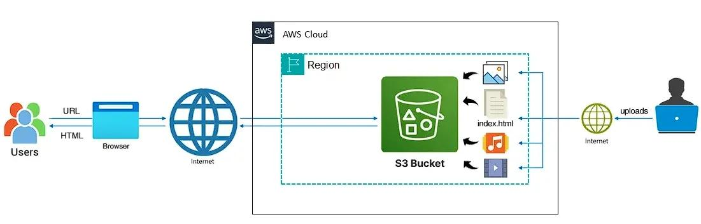

# 🌐 Static Website Hosting on AWS S3

## 🚀 Project Overview

This project demonstrates how to host a static website using Amazon S3.
The website is built using HTML, CSS, and JavaScript and deployed on AWS.

---

## 🧠 Architecture Diagram

---

## 🖥️ Website Preview

### 🏠 Homepage

### 🧩 Services Section

### 🖼️ Gallery Section

---

## ⚙️ Technologies Used

* AWS S3 (Static Website Hosting)
* HTML5, CSS3, JavaScript

---

## 🌍 Live Website

👉 http://sanju-bucket26.s3-website.ap-south-2.amazonaws.com

---

## 📌 Features

* Responsive design
* Image gallery
* Contact form (demo)
* Hosted on AWS cloud

---

## 🛠️ Setup Steps

1. Create S3 bucket
2. Enable static website hosting
3. Upload files
4. Add bucket policy for public access
5. Access via S3 endpoint URL

---

## 📈 Future Improvements

* Add CloudFront for CDN
* Connect custom domain
* Add backend for contact form

---

## 👨‍💻 Author  https://github.com/sanjeeva26/S3-static-website.git

